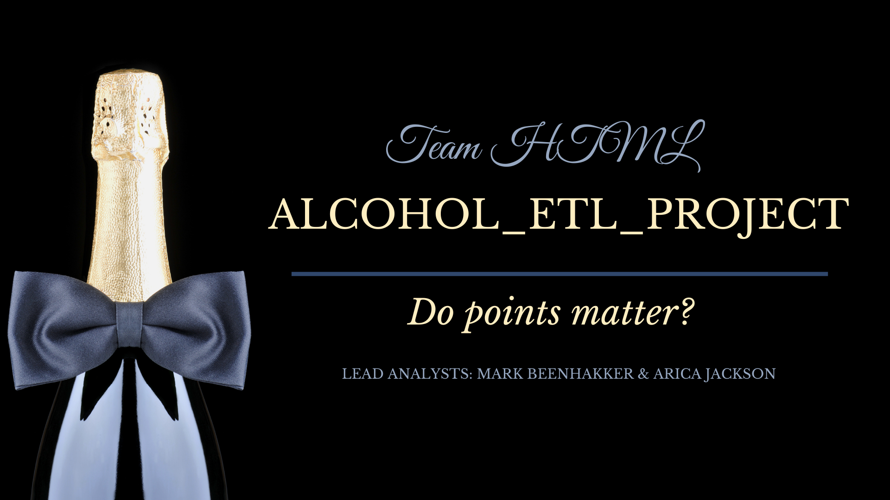

## Alcohol_ETL
<!--  -->

A case study of Extract, Transform, Load

### Instructions

* Create an `alcohol_etl_db` database in pgAdmin 4 then create the following two tables within:

  * A `wine_data_json` table that contains the columns `id`, `winery`, `variety`, 'description', 'price', 'region_1', 'region_2', 'points'.

  * A `wine_data_transformed` table that contains the columns `winery, `variety`, `description`, `price`, 'region_1', 'region_2', 'points', value.

  * Be sure to assign a primary key, as Pandas will not be able to do so.

* In Jupyter Notebook perform all ETL.

* **Extraction**

  * Put each CSV into a pandas DataFrame.

* **Transform**

  * Copy only the columns needed into a new DataFrame.

  * Rename columns to fit the tables created in the database.

  * Handle any duplicates. **HINT:** some locations have the same name but each license number is unique.

  * Set index to the previously created primary key.

* **Load**

  * Create a connection to database.

  * Check for a successful connection to the database and confirm that the tables have been created.

  * Append DataFrames to tables. Be sure to use the index set earlier.

* Confirm successful **Load** by querying database.

* Join the two tables.

